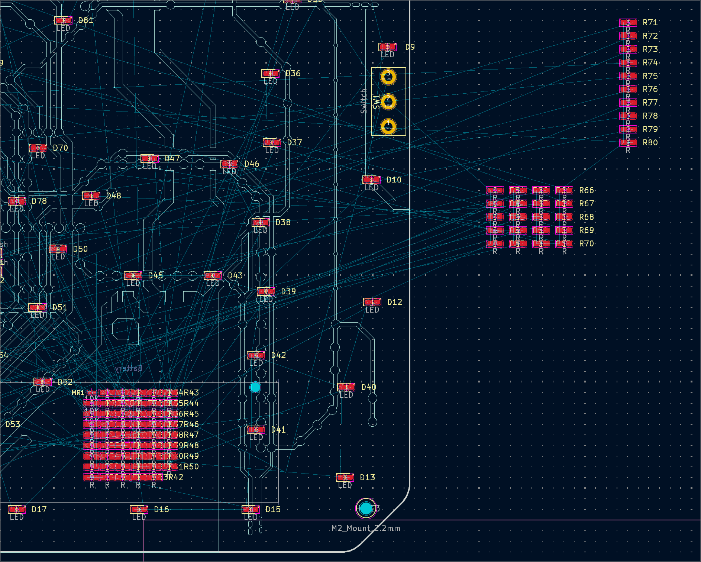
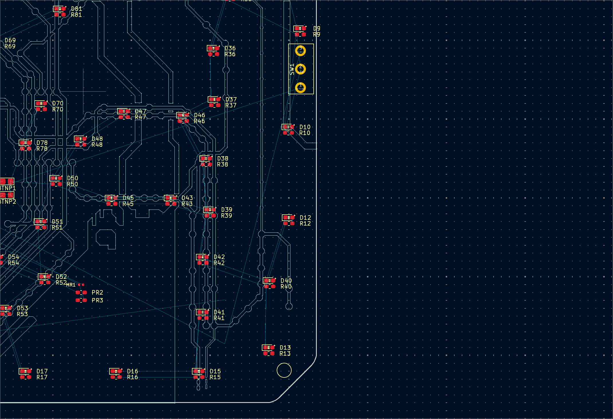

# match_resistor_to_led.py

## Purpose

This is a helper script to automatically match all the SMD resistors to the corresponding LED in a PCB design.

In order for this to work, the LED references need to be D1, D2, D3, etc. and the resistor references need to be R1, R2, R3, etc. The numbers must also match.

**Before Matching**


**After Matching**


## Usage

This runs on python 3.12.0.

The script has a few constants that can be modified to fit the specific design:

- `DIODE_FOOTPRINT_PREFIX` - The prefix for the LED references
- `RESISTOR_FOOTPRINT_PREFIX` - The prefix for the resistor references
- `OFFSET` - The offset between the LED and resistor references

To use this script, run the following command:

```bash
python match_resistor_to_led.py <input_file> <output_file>
```
